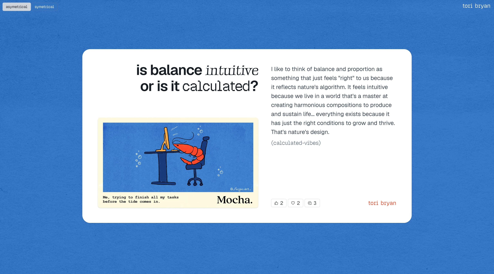
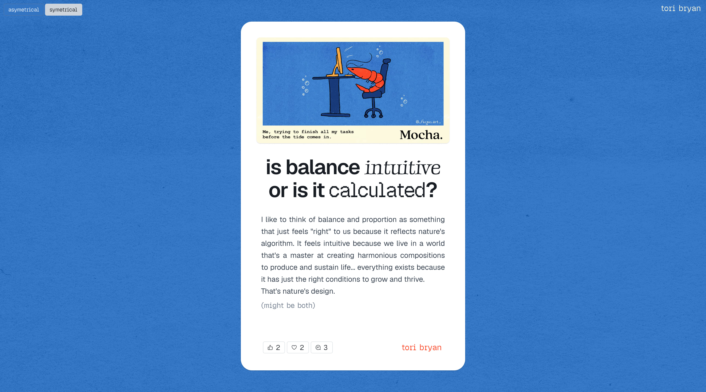
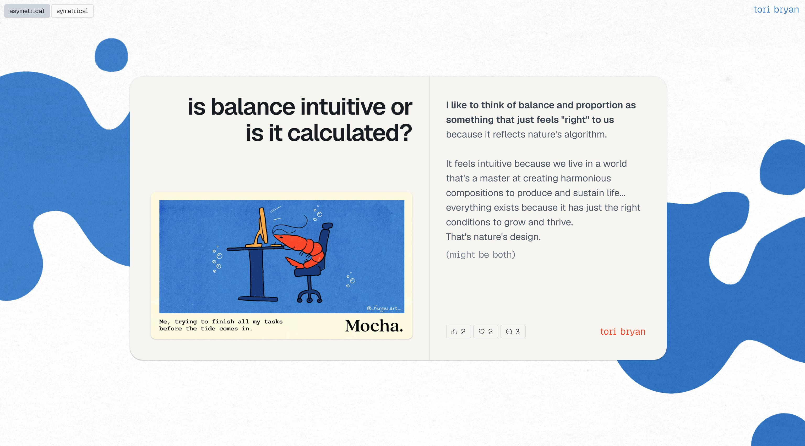
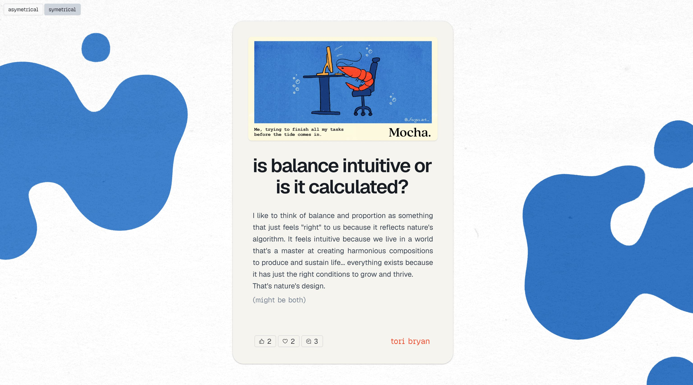

## The prompt

45 minutes. The core design element: Balance. Take one idea and build two versions of it — one symmetric, one asymmetric.

## My approach

Instead of designing an interface about something else, I made the interface answer the prompt back. A magazine page — Mocha. — with the layout itself doing the arguing.

## Two aesthetic directions

I ran the pair twice. Once in a clean editorial treatment on solid blue. Once with organic blob shapes surrounding a lighter card. Same question, same answer, different arguments about what balance looks like on the page.

## What I learned

The prompt asked for one idea in two versions. What made it click was letting the argument be the design — not designing about balance, but designing balance as an argument. Symmetry felt safer, more editorial. Asymmetry gave the layout the tension that mirrored the question itself.

## Credits

Illustration by @_fergus.art_
